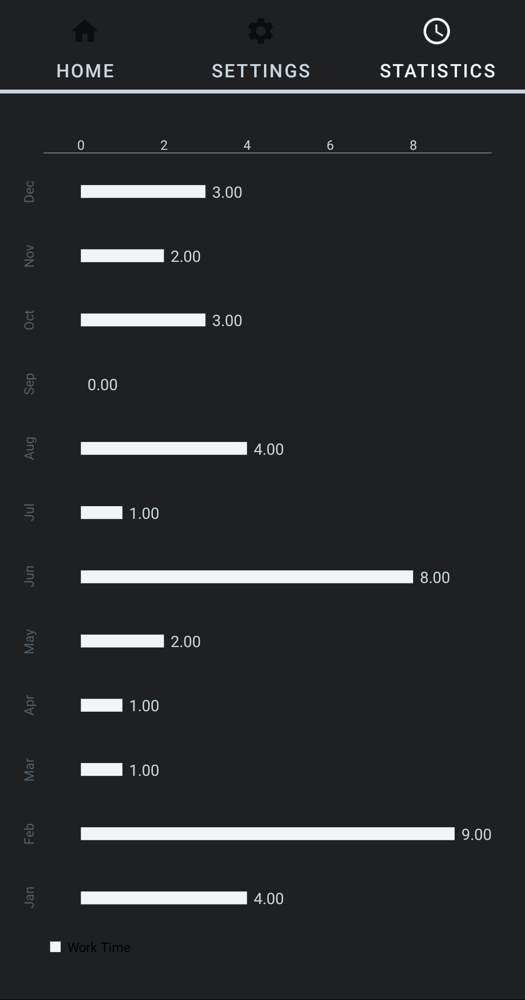

# OSTT - Open Source Tomato Timer (ALPHA)

**From [Wikipedia:](https://en.wikipedia.org/wiki/Pomodoro_Technique)**

The Pomodoro Technique is a time management method developed by Francesco Cirillo in the late
1980s.The technique uses a timer to break down work into intervals, traditionally 25 minutes in
length, separated by short breaks. Each interval is known as a pomodoro, from the Italian word for '
tomato', after the tomato-shaped kitchen timer that Cirillo used as a university student.

The technique has been widely popularized by dozens of apps and websites providing timers and
instructions. Closely related to concepts such as timeboxing and iterative and incremental
development used in software design, the method has been adopted in pair programming contexts.

### Home Page

### Settings Page

### Statistics Page

## External References

* **Chart**
    * [MPAndroidChart](https://github.com/PhilJay/MPAndroidChart)
* **SeekBar**
    * [IndicatorSeekBar](https://github.com/warkiz/IndicatorSeekBar)
* **ProgressBar**
    * [NumberProgressBar](https://github.com/daimajia/NumberProgressBar)
* **CountDown**
    * [CountDownView](https://github.com/iwgang/CountdownView)

## Contributing

Pull requests are welcome. For major changes, please open an issue first to discuss what you would
like to change.

Please make sure to update tests as appropriate.

## License

[MIT](https://github.com/MarioAvolio/Care-TomatoTimer/blob/master/LICENSE)
